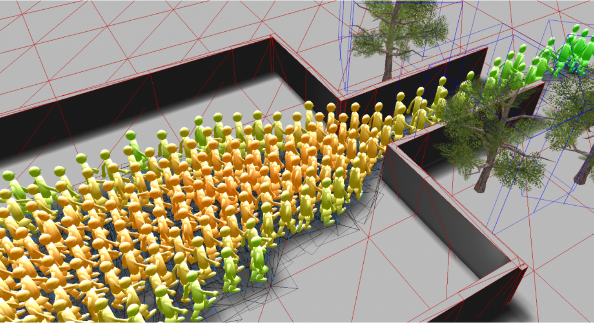

# Machine Learning in Crowd Modeling & Simulation

## Overview

Welcome to the repository for our course **Machine Learning in Crowd Modeling & Simulation** at the Technical University of Munich (TUM). This course involves practical applications of machine learning techniques in the field of crowd modeling and simulation. Our work is organized into five exercises and one comprehensive project, each documented with detailed reports.

## Structure

- **Exercises:**
  - **Exercise 1:** Modeling of Crowds
  - **Exercise 2:** Simulation Software
  - **Exercise 3:** Representation of Data
  - **Exercise 4:** Bifurcation and Visualization
  - **Exercise 5:** Learning Dynamical Systems 

- **Project:**
  - **Project Title:** Dimensionality Reduction Techniques for High-Dimensional Data
  - **Description:** 
    In this project, we explored various dimensionality reduction techniques to handle high-dimensional datasets effectively. Our primary focus was on Diffusion Maps, a non-linear dimensionality reduction algorithm, to visualize and understand complex data structures. We compared the performance of different libraries such as Scikit-learn, Megaman, and Datafold for these techniques. The project included applying these methods to datasets like the Swiss Roll, Word2Vec. We implemented and analyzed the Spectral Embedding method, emphasizing its application in clustering and visualization tasks.
  - **Reports:** [Link to the project report](Project/Final_Project_Report_Group_H/Final_Project_Group_H.pdf)

## Reports

Each exercise and project has a corresponding report folder:
- [Exercise 1 Report](Exercise01/Report_1_Group_H)
- [Exercise 2 Report](Exercise02/Report_2_Group_H)
- [Exercise 3 Report](Exercise03/Report_3_Group_H)
- [Exercise 4 Report](Exercise04/Report_4_Group_H)
- [Exercise 5 Report](Exercise05/Report_5_Group_H)
- [Project Report](Project/Final_Project_Report_Group_H)

These folders contain detailed documentation and analysis of our work.

## Acknowledgements

This coursework was completed with the collaboration and effort of the following team members:
- [Hammad Basit](https://github.com/Hammad-7)
- [Milena Schwarz](https://github.com/misc99s)
- [Antonia Gobillard](https://github.com/antoniagbrd)
- [Nayeon Ahn](https://github.com/annaaa4701)
- Muhammed Yusuf Mermer

Special thanks to our instructor for their guidance and support throughout this course.